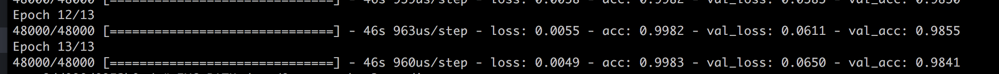

## Convolutional Neural Network trained for mnist dataset
Small Neural Network trained on [mnsit](http://yann.lecun.com/exdb/mnist/) dataset with Keras (Tensorflow backend).

### How to use
I have created a Dockerfile with all the dependencies. To pass the display and be able to use [Matplotlib](https://matplotlib.org/) to display images with the Docker container, I also used [XQuartz](https://www.xquartz.org/).

To use the Docker image with Matplotlib:
1. Build the Docker image from the Dockerfile `docker build -t pythonml .`
2. Start XQuartz `open -a XQuartz`
3. In a bash session, add localhost to xhost and export the display `xhost + 127.0.0.1` and then `export DISPLAY=host.docker.internal`
4. Start a bash session in the Docker container `docker run -it -e DISPLAY=host.docker.internal:0 -v $PWD:/t -w /t pythonml bash`

Train the network within the Docker container: `python3 model.py` <br/>
Predict on a single input: `IMG_PATH=<img_path> python3 predict.py`

### Accuracy, val_loss and val_acc after 13 epochs:
Achieved 98% on validation set.


### Architecture of Network
```
_________________________________________________________________
Layer (type)                 Output Shape              Param #
=================================================================
lambda_1 (Lambda)            (None, 28, 28, 1)         0
_________________________________________________________________
conv2d_1 (Conv2D)            (None, 26, 26, 64)        640
_________________________________________________________________
max_pooling2d_1 (MaxPooling2 (None, 13, 13, 64)        0
_________________________________________________________________
flatten_1 (Flatten)          (None, 10816)             0
_________________________________________________________________
dense_1 (Dense)              (None, 128)               1384576
_________________________________________________________________
dense_2 (Dense)              (None, 10)                1290
=================================================================
Total params: 1,386,506
Trainable params: 1,386,506
Non-trainable params: 0
```

#### Notes
- You may need to install tkinter. For that, just issue `apt-get install python3-tk` within the bash session of the Docker container.

#### Errors along the way
- I was training with white numbers on black background and testing input with inverse colors, which gives me wrong results.  
- I obtained way better accuracy by not using a Dropout layer in the network.
- It is much slower to use `fit_generator()` than `fit()`, hence `fit()` has been used. fa
